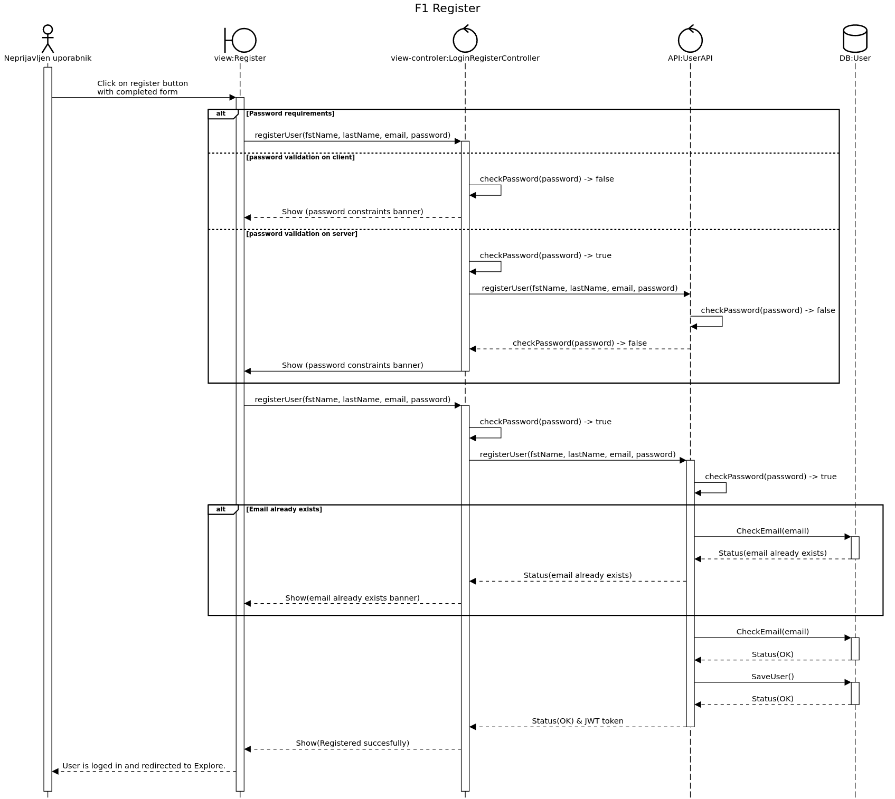

# Načrt sistema

|                             |                                                         |
| :-------------------------- | :------------------------------------------------------ |
| **Naziv projekta**          | Walk Doggers |
| **Člani projektne skupine** | Matic Bregar, Domen Vilar, Timotej Petrič, Mustafa Grabus in Domen Bukovac |
| **Kraj in datum** | Ljubljana, 16.04.2021 |                              |
 

Povzetek
===

Ta dokument predstavlja podroben načrt sistema, katerega smo opisali v drugem delu projketa, v tem dokumentu bolj tehnično predstavimo posamezne komponente in delovanje sistema.

Za načrta arhitekture smo uporabili vzorec **MVC**. Prikaz načrta arhitekture predstavimo z dvemi pogledi:  
**logični pogled:** predstavljen s pomočjo blokovnega diagrama 
**razvojni pogled:** predstavljen z UML komponentnem diagramom.

Načrt strukture sistema je prikazan z razrednim diagramom, kjer so prikazane povezave med razredi. Celotnemu diagramu zaporedja pa sledi tudi posamezen razedni diagram za vsako funkcionalnost, zaradi preglednosti.

Pri načrtih obnašanja smo uporabili diagrame zaporedji, ki prikazejo zaporedje akcji, ki jih izvajlajo posamezne vloge uporabnikov, ter sistemske komponente. Za vsako funkcinalnost iz drugega dela projketa prikažemo osnove, alternativne ter izjemne tokove.

Uporabili smo dva načrtovalska vzorca, in sicer:
**Singleton** in
**State**

## 1. Načrt arhitekture

**TO-DO**

- Za prikaz uporabite enostavne prikaze, kot so blokovni ali paketni diagrami. Uporabite arhitekturne vzorce.

## 2. Načrt strukture

### 2.1 Razredni diagram

**TO-DO**

- Izdelajte razredni diagram.

### 2.2 Opis razredov

**TO-DO**

- Vsak razred podrobno opišite. Opis posameznega razreda naj ima sledečo strukturo:

#### Ime razreda **TO-DO**

- Koncept iz problemske domene, ki ga razred predstavlja.

#### Atributi

**TO-DO**

- Za vsak atribut navedite:
  - ime atributa,
  - podatkovni tip, če ta ni očiten,
  - pomen, če ta ni samoumeven,
  - zalogo vrednosti, če ta ni neomejena ali očitna.

#### Nesamoumevne metode

**TO-DO**

- Za vsako metodo navedite:
  - ime metode,
  - imena in tipe parametrov,
  - tip rezultata,
  - pomen (če ta ni dovolj očiten iz naziva metode in njenih parametrov).

## 3. Načrt obnašanja

### 3.1.1 F1 Registracija

Slika prikazuje diagram zaporedja za osnovni tok in izjemna tokova ko se **Neprijavljen uporabnik** registrira v sistem.

Alternativni tok za Registracijo se nahaja na pri alternativnem toku za prijavo.

### 3.1.2 F2 Prijava

Slika prikazuje diagram zaporedja za osnovni tok in izjemna tokova ko se **Neprijavljen uporabnik** prijavi v sistem.

### F1&F2 Registracija in Prijava Alternativni tok

Slika prikazuje diagram zaporedja za alternativni tok registracije in prijave, ki se zgodi ko **Neprijavljen uporabnik** poskuša uporabljati aktivnosti, ki mu niso dovoljene. Alternativni tok se nadaljuje z osnovnim tokom.

### 3.1.3 F3 Prijava na oglas

Slika prikazuje diagram zaporedja za osnovni tok prijave na oglas, ki se zgodi ko se **Prijavljen uporabnik** poskuša prijaviti na oglas za sprehajanje psa. Izjemni tok pa prikazuje, prikaz obvestila ko oglasov v bližini ni.

### 3.1.4 F4 Potrditev sprehajalca

Slika prikazuje diagram zaporedja za osnovni tok Potrditeve sprehajalca, za objavljen oglas, uporabnika z vlogo **Prijavljen uporabnik** , ki je lastnik psa. S tem potrdi zaiteresiranega sprehajalca, in potrdi njegov sprehod. 

## F4 Potrditev sprehajalca alternativni tok

Slika prikazuje diagram zaporedja za alternativni tok Potrditve sprehajalca za objavljen oglas, uporabnika z vlogo **Prijavljen uporabnik** , ki je lastnik psa. Do željenega učinka pride preko inbox razdelka kjer se izvajanje kasneje nadaljuje na osnovnem toku.

### 3.1.5 F5 Kontaktiranje sprehajalca za dodatne informacije

Slika prikazuje diagram zaporedja za Osnovni tok Kontaktiranje sprehajalca za objavljen oglas, uporabnika z vlogo **Prijavljen uporabnik** , ki je lastnik psa. Do željenega učinka pride preko razdelka listings.

## F5 Kontaktiranje sprehajalca za dodatne informacije alternative.

Slika prikazuje diagram zaporedja za alternativni tok Kontaktiranje sprehajalca za objavljen oglas, uporabnika z vlogo **Prijavljen uporabnik** , ki je lastnik psa. Do željenega učinka pride preko inbox razdelka kjer se izvajanje kasneje nadaljuje na osnovnem toku.

### 3.1.6 F6 Kontaktiranje lastnika za dodatne informacije

Slika prikazuje diagram zaporedja za alternativni tok Kontaktiranje lastnika, uporabnika z vlogo **Prijavljen uporabnik** , ki želi sprehajati psa, katerega je zasledil na oglasu pred tem pa želi več infromaciji od lastnika. Do željenega učinka pride preko razdelka Listings.

## F6 Kontaktiranje lastnika za dodatne informacije alternative

Slika prikazuje diagram zaporedja za alternativni tok Kontaktiranje lastnika, uporabnika z vlogo **Prijavljen uporabnik** , ki želi sprehajati psa, katerega je zasledil na oglasu pred tem pa želi več infromaciji od lastnika. Do željenega učinka pride preko razdelka Inbox v prvem primeru v drugem pa preko razdelka Explore.

