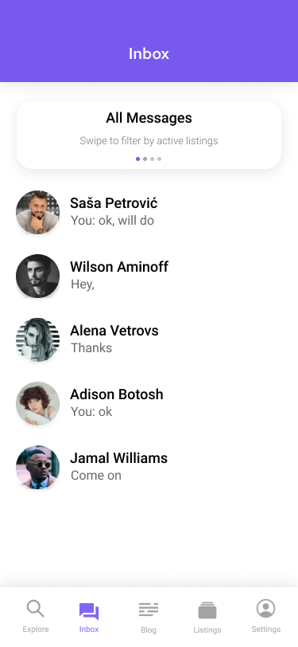
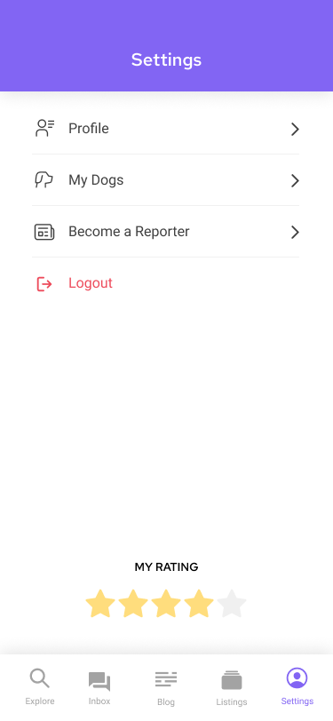

# Dokument zahtev

|                             |                                                         |
| :-------------------------- | :------------------------------------------------------ |
| **Naziv projekta**          | Dog Walkers |
| **Člani projektne skupine** | Matic Bregar, Domen Vilar, Timotej Petrič, Mustafa Grabus in Domen Bukovac |
| **Kraj in datum** | Ljubljana, 05.04.2021 |                              |

## Povzetek projekta

Sedaj, ko se je tempo življenja v času epidemije covid-19 malo upočasnil, mnogo ljudi preživi veliko časa doma. Menimo, da je zdaj morda primeren čas za posvojitev kakšne domače živali, saj lahko več časa namenijo skrbi in vzgajanju le-te. 

Kaj pa se bo zgodilo, ko se bo življenje vrnilo na stare tirnice in bodo spet morali v službo, kdo bo takrat skrbel za domače živali? Veliko ljudi pa si morda želi samo ukvarjati se z živalmi, ne želijo pa jih posvojiti, ker je to za njih prevelika odgovornost, zato mi ponujamo rešitev. Uporabniki, ki bodo preživeli veliko časa zdoma, bodo lahko na naši platformi izbrali primerno osebo, ki bo njihove žival peljala na sprehod ali pa na njih popazila, medtem ko bodo oni zdoma ali pa zaradih drugih razlogov nimajo dovolj časa za skrb hišnih ljubljenčkov.

Aplikacija bo vsebovala intuitiven uporabniški vmesnik, ki bo omogočal enostavno iskanje primernih sprehajalcev oz skrbnikov.

## 1. Uvod

Današnja družba je vsak trenutek dneva z nečim zaposlena in okupirana z vseh strani z mediji, oglasi, spletnimi omrežji, predvsem pa večino časa preživi v službi.
Čas je ena izmed najbolj pomembnih vrednot. Velikokrat ga zmanjka za kakšno opravilo ali aktivnost, pa čeprav je ta nujna. Ko lastniki psov spoznajo, da svojemu ljubljenčku ne morejo nuditi vsega, kar potrebuje, velikokrat le ta konča v zavetišču.

Naša aplikacija bo reševala problem zasedenih lastnikov psov, ki jim zaradi vseh obveznosti včasih zmanjka časa, da bi za njih skrbeli spodobno. Z aplikacijo želimo doseči, da se bodo zasedeni lastniki psov odločili za našo rešitev, namesto da dajo psa v zavetišče. S tem bomo razbremenili zasedenost pasjih zavetišč in poskrbeli, da bo čim več kosmatincev imelo topel dom, kjer se bodo počutili ljubljene in zaželene.

Aplikacija Dog Walkers bo omogočala uporabnikom, da bodo za svoje ljubljenčke ustvarili pasje profile, za katere bodo lahko ustvarili oglas za sprehod ali drugačno oskrbo, ko lastnik za to nima časa. Profil psa bi vseboval vse potrebne informacije o psu, torej kako mu je ime, kratek opis, težo ter slika psa. Prijavljena oseba ima svoj profil, na katerih bo vidna povprečna ocena osebe za lažje odločanje ali je potencialen sprehajalec oz. lastnik primeren. 

Oglas, ki ga bo objavil lastnik, bo vseboval informacije o psu, lokacijo, datum in uro termina. Vseboval bo tudi kratek opis oglasa, kjer bo lastnik lahko napisal pomembne informacije ali opombe. Oglase bo lahko videl prijavljeni ali neprijavljeni uporabnik, torej bodo javno dostopni vsem. Samo prijavljeni uporabniki se bodo lahko prijavljali na oglase. Oglasi bodo sortirani glede na oddaljenost lastnika. Pred dejanskim srečanjem in oddajo psa se bo sprehajalec v primeru dodatnih vprašanj najprej prijavil na oglas in nato tudi kontaktiral lastnika prek integriranega sporočilnega sistema.
Lokacija oglasa oz. sprehoda se bo samodejno pridobila pri procesu kreiranja oglasa. Naslov začetka sprehoda bo pridobljen iz pridobljenih koordinat prek zunanjega sistema Reverse Geocoding za pridobivanje naslovov iz koordinat.

Lastnik se bo izmed prijavljenih kandidatov po lastni presoji odločil za enega od sprehajalcev. Pomagal si bo lahko z oceno in pa tudi izmenjanimi sporočili. Izbranemu sprehajalcu bo sprehod odobril, vsi ostali potencialni kandidati, pa bodo na oglasu videli, da je njihova prošnja za sprehajanje zavrnjena.

Aplikacija bo prijavljenim ali neprijavljenim uporabnikom obogočala prebiranje objav na blogu. Na blog bodo lahko uporabniki z vlogo pisca objav objavljali nove zanimive objave. Objave bodo tematsko povezane predvsem s psi, njihovo nego in zanimivimi nasveti. Vsak prijavljen uporabnik bo lahko postal pisec bloga, in sicer s povišanjem samega sebe v Reporterja v razdelku Settings.

Ker v hitrem življenjskem slogu pogosto prihaja do nenadnih sprememb, in ne moremo vsega predvideti vnaprej, aplikacija omogoča tudi urejanje. Urejati bo mogoče profile psov in uporabnikov.

Omenili in deloma opisali smo že, da je **prijavljeni uporabnik** lahko v vlogi lastnika psa, ki bo za svojega psa iskal sprehajalce. Slednji bodo zaradi ljubezni do živali ali želje po oddihu v naravi iskali pse, da bi z njimi preživeli svoj prosti čas na svežem zraku. Svoje vtise in znanje o živalih bodo lahko delili tudi **pisci bloga** tako, da bodo svojo zgodbo objavili na naši platformi. Za vzdrževanje kakovostnih vsebin bodo skrbeli **moderatorji**, ki bodo potrjevali nove blog objave in **administratorji**, ki bodo brisali neprimerne oglase.

Aplikacija ima tudi kar nekaj nefunkcionalnih zahtev. Pri sami aplikaciji bomo poskrbeli, da bo aplikacija dostopna 24 ur na dan z izjemo izpadov na katere bomo pripravljeni in jih čim hitreje odpravili. Mora delovati nemoteno, kljub temu da jo bo sočasno uporabljalo par 100 uporabnikov, ki na posamezno zahtevo ne smejo čakati več kot 3 sekunde. Za uporabniško izkušnjo bomo poskrbeli tako, da bo uporabnik lahko prišel na kateri koli pogled v aplikaciji v manj kot petih klikih.

Zaupni podatki bodo na voljo samo razvijalski ekipi, ki bo za tekoče nemoteno delo uporabljala sistem Git in Kanban tablo.

Aplikacija ne sme biti žaljiva ter rasisitična, zato bodo morali naši moderatorji in admini takšne vsebine odstraniti v manj kot dnevu. Dostop do aplikacije bodo imeli vsi ljudje ter psi ne glede na raso ter pasmo. Hranjenje in deljenje podatkov pa bo skladno s slovensko zakonodajo ter evropsko GDPR ureditvijo.

## 2. Uporabniške vloge

**TO-DO**

- Opredelite glavne tipe uporabnikov vaše aplikacije glede na funkcionalnosti, ki jih imajo na voljo.
- Zelo pomembno je, da uporabniške vloge konsistentno imenujete. Na primer, če ste definirali vlogo **učitelj**, morate povsod uporabljati samostalnik **učitelj**, ne pa morda **profesor** ali **pedagog**. Tehniška besedila žal ne morejo dosegati leposlovnih standardov, tudi če so še tako dobro napisana.

## 3. Slovar pojmov

| **Pojem** | **Opredelitev** |
| - | - | 
|email | e-poštni naslov
|sprehajalec | prijavljeni uporabnik, ki se je prijavil na oglas
|lastnik oglasa | prijavljeni uporabnik, ki je objavil oglas
|potrjeni oglas | lastnik oglasa je prijavljenega sprehajalca potrdil za oglas
|Reporter | imenovanje vloge pisca bloga, v katero se lahko poviša vsak prijavljen uporabnik v nastavitvah
|status Pending| status oglasa, ki pove, da lastnik oglasa še ni potrdil nobenega sprehajalca oz. sprehajalcu lastnik še ni potrdil prijave na oglas
|status Completed | status oglasa, ki pove, da je imel oglas potrjenega sprehajalca in je časovno potekel
|status Arranged | status oglasa, ki pove, da ima oglas potrjenega sprehajalca
|status Requested | status oglasa, ki pove, da se sprehajalec zanima za oglas
|status Listed | status oglasa
|status Finished | status oglasa, ki pove, da je oglas končan (status Completed) in sprehajalec oz. lastnik je ocenjen
|sporočilno okno | pogled v katerem dva prijavljena uporabnika lahko komunicirata med sabo
|lastnik | prijavljen uporabnik, ki ima objavljen vsaj en oglas
|sprehajalec | prijavljen uporabnik, ki se je prijavil na vsaj en oglas za sprehajanje psa
|razdelek | Glavni meniji aplikacije. Vseh razdelkov je pet (od leve proti desni): Explore, Inbox, Blog, Listings, Settings. |Smiselno ločujejo aplikacijo.
|razdelek Explore | prikazuje seznam oglasov
|razdelek Inbox | prikazuje sporočila z ostalimi uporabniki
|razdelek Blog | prikazuje seznam objav
|razdelek Listings | prikazuje seznam oglasov na katere smo se prijavili in seznam oglasov, ki smo jih objavili
|razdelek Settings | razdelek, kjer lahko prijavljen uporabnik ureja nastavitve svojega profila
|Filtrirno okno oglasov | prvo mesto v filtrirnem oknu zasede All Messages, nasledna pa so v časovnem zaporedju razporejeni oglasi od najnovejših do najstarejših med katerimi se premikamo z drsnim potegom

## 4. Diagram primerov uporabe

## 5. Funkcionalne zahteve

### Registracija

Neprijavljen uporabnik se lahko registrira na strani. Ob registraciji vpiše ime, priimek, email in geslo.

#### Osnovni tok

1. Neprijavljen uporabnik izbere funkcionalnost registracija.
2. Aplikacija mu ponudi registracijski obrazec.
3. Neprijavljen uporabnik izpolni registracijski obrazec. Vpiše svoje ime, priimek, email in geslo. Geslo je dolgo vsaj 8 znakov in sestavljeno iz velikih in malih črk, številk ter vsaj enega posebnega znaka.
4. Neprijavljen uporabnik odda registracijski obrazec.
5. Aplikacija prikaže obvestilo o uspešni registraciji.

#### Alternativni tok

**Alternativni tok 1**

1. Neprijavljen uporabnik želi dostopati do funkcionalnosti, ki je na voljo le prijavljenim uporabnikom.
2. Aplikacija neprijavljenemu uporabniku prikaže obvestilo, da je zahtevana funkcionalnost na voljo le prijavljenim uporabnikom. Aplikacija ponudi možnost preusmeritve na registracijsko stran.
3. Neprijavljen uporabnik izbere možnost za preusmeritev na stran za registracijo (funkcionalnost registracija).
4. Aplikacija mu ponudi registracijski obrazec.
5. Neprijavljen uporabnik izpolni registracijski obrazec. Vpiše svoje ime, priimek, email in geslo. Geslo je dolgo vsaj 8 znakov in sestavljeno iz velikih in malih črk, številk ter vsaj enega posebnega znaka.
6. Neprijavljen uporabnik odda registracijski obrazec.
7. Aplikacija prikaže obvestilo o uspešni registraciji.

#### Izjemni tok

**Izjemni  tok 1**
* Neprijavljen uporabnik je za registracijo uporabil email naslov, ki je že vezan na nek uspešno registriran račun. Aplikacija vrne obvestilo o že uporabljenem email naslovu in ga pozove k uporabi drugega.

**Izjemni  tok 2**
* Neprijavljen uporabnik vnese geslo, ki ni sestavljeno iz velikih in malih črk, številk ter vsaj enega posebnega znaka in ni dolgo vsaj 8 znakov. Obrazec odda. Aplikacija prikaže obvestilo o neprimernem geslu.

#### Pogoji
* Neprijavljen uporabnik aplikacije za uspešno izvedeno registracijo še ne sme biti prijavljen ali registriran v sistem z email naslovom, ki ga je vpisal v registracijski obrazec.

#### Posledice
* Če neprijavljen uporabnik dobi obvestilo o uspešni registraciji, je uspešno registriran. Sedaj se lahko prijavi v aplikacijo s svojim email naslovom in geslom, ki ga je vnesel ob registraciji v registracijski obrazec. Po uspešni prijavi dobi dostop do več funkcionalnosti aplikacije.

#### Posebnosti

Registracijski podatki se med aplikacijo in strežnikom prenašajo po varni povezavi. V bazi so shranjeni z upoštevanje priporočil dobre in varne prakse hranjenja občutljivih podatkov.

#### Prioritete identificiranih funkcionalnosti

MUST HAVE

#### Sprejemni testi

* **[Osnovni tok]** Neprijavljen uporabnik izpolne registracijski obrazec. Sedaj se lahko prijavi v sistem.
* **[Alternativni tok 1]** Neprijavljen uporabnik želi dostopati do funkcionalnosti, ki je na voljo le prijavljenim uporabnikom. Aplikacija mu ponudi možnost preusmeritve na registracijsko stran.
* **[Izjemni tok 1]** Neprijavljeni uporabnik je za registracijo uporabi email naslov, ki je že vezan na nek uspešno registriran račun. Aplikacija mu prepreči registracijo s tem email naslovom in mu prikaže obvestilo o že uporabljenem email naslovu ter ga pozove k uporabi drugega.
* **[Izjemni tok 2]** Neprijavljen uporabnik vnese geslo, ki ni pravilne oblike. Po oddaji obrazca dobi obvestilo o neprimernem geslu.

## 6. Nefunkcionalne zahteve

**TO-DO**

- Navedite splošne omejitve, ki jih moramo upoštevati v več funkcionalnostih ali celo skozi celoten razvoj aplikacije.

## 7. Osnutki zaslonskih mask

**TO-DO**

#### Explore

#### Inbox

#### Blog

#### Listings

#### Profile

## 8. Prototipi vmesnikov

**TO-DO**

- Navesti je potrebno: zaslonske maske, sistemske vmesnike in vmesnike do naprav, vključno z referencami do primerov uporabe.
